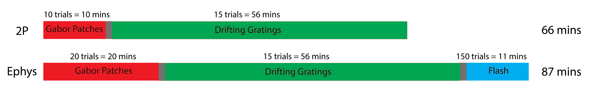

# OpenScope V2 species:
A temporary repository for the OpenScope V2 species project

# Installation
## Dependencies:
  - Windows OS (see Camstim package)
  - python 2.7
  - psychopy 1.82.01
  - camstim 0.2.4
  - matplotlib 2.2.3

## Installation with Anaconda or Miniconda:
  1. Navigate to repository and install conda environment:
      `conda env create -f environment.yml`

  2. Activate the environment:
      `conda activate allen_stimulus`

  3. Install the AIBS camstim package in the environment:
      `pip install camstim/.`

  4. Install matplotlib library:
      `conda install matplotlib`

  5. Download required video clips from movie_clips.zip and extract into the data directory.

# Running the scripts
  1. Activate the environment:
      `conda activate allen_stimulus`
     
  3. Run the stimulus_v2species_2p.py script for 2P stimuli:
       `python stimulus_v2species_2p.py`

  4. Run the stimulus_v2species_2p.py script for ephys stimuli:
       `python stimulus_v2species_ephys.py`

# Stimulus design
The experiment consists of both ephys (Neuropixels) and calcium imaging (2P imaging with Gcamp viral vectors) recordings, in separate mice. Neuropixels recordings consist of 4 simultaneous probes across V1, covering the extent of the visual field map. 2P imaging recordings consist of 12 FOVs, imaged 4 at a time, also across the span of the visual field of V1. 

The stimuli used for Neuropixels and 2P are similar, with the exception of full-field flashes, which rquire temporally precise responses and are therefor only used with Neuropixels recordings. Warping is applied to the monitor.

Gabor Patches: Small drifting grating patches tiling the monitor, used to map receptive fields. Each patch is 20 degrees, with 10 degree overlap. TF and SF are fixed but orientation varies (0, 45,90).

Drifting Gratings: Typical drifting gratings, with 5 TF (1.0, 2.0, 4.0, 8.0, 15.0) and 5 SF (0.02, 0.04, 0.08, 0.16, 0.32), and 4 orientations (0,45,90,135). 

Full-field flash: Full-field bright or dark flashes.

Due to technical constraints, the duration of 2P recordings is more limited than Neuropixels recordings, so the number of repeated trials varies by stimulus modality.

For stimulus_v2species_2p.py, these parameters are currently hard-coded:
    nb_runs_ephys_rf = 10
    nb_run_gratings = 15

For stimulus_v2species_ephys.py, these parameters are currently hard-coded:
    nb_runs_ephys_rf = 20
    nb_run_gratings = 15
    nb_run_flash = 150